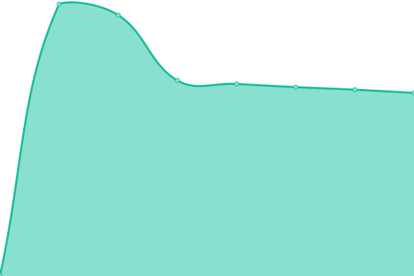
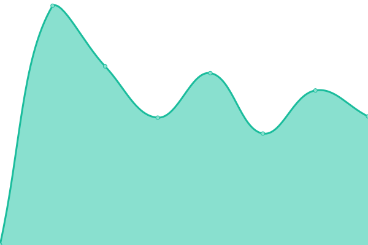
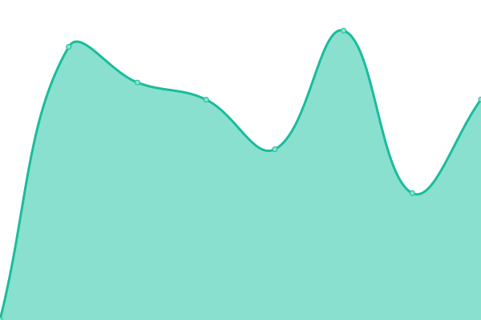

# [📈 Live Status](https://bouncepaw.github.io/the-monitor): <!--live status--> **🟩 All systems operational**

This repository contains the open-source uptime monitor and status page for [Timur Ismagilov](https://bouncepaw.com), powered by [Upptime](https://github.com/upptime/upptime).

With [Upptime](https://upptime.js.org), you can get your own unlimited and free uptime monitor and status page, powered entirely by a GitHub repository. We use [Issues](https://github.com/bouncepaw/the-monitor/issues) as incident reports, [Actions](https://github.com/bouncepaw/the-monitor/actions) as uptime monitors, and [Pages](https://bouncepaw.github.io/the-monitor) for the status page.

<!--start: status pages-->
<!-- This summary is generated by Upptime (https://github.com/upptime/upptime) -->
<!-- Do not edit this manually, your changes will be overwritten -->
<!-- prettier-ignore -->
| URL | Status | History | Response Time | Uptime |
| --- | ------ | ------- | ------------- | ------ |
|  [Main](https://bouncepaw.com) | 🟩 Up | [main.yml](https://github.com/bouncepaw/the-monitor/commits/HEAD/history/main.yml) | 

 626ms
     
 | 

<a href="https://bouncepaw.github.io/the-monitor/history/main">100.00%</a>
    

|  [Garden](https://garden.bouncepaw.com) | 🟩 Up | [garden.yml](https://github.com/bouncepaw/the-monitor/commits/HEAD/history/garden.yml) | 

 750ms
     
 | 

<a href="https://bouncepaw.github.io/the-monitor/history/garden">100.00%</a>
    

|  [Links](https://links.bouncepaw.com) | 🟩 Up | [links.yml](https://github.com/bouncepaw/the-monitor/commits/HEAD/history/links.yml) | 

 918ms
     
 | 

<a href="https://bouncepaw.github.io/the-monitor/history/links">100.00%</a>
    

|  [Mycorrhiza](https://mycorrhiza.wiki) | 🟩 Up | [mycorrhiza.yml](https://github.com/bouncepaw/the-monitor/commits/HEAD/history/mycorrhiza.yml) | 

 778ms
     
 | 

<a href="https://bouncepaw.github.io/the-monitor/history/mycorrhiza">100.00%</a>
    

|  [Betula website](https://betula.mycorrhiza.wiki) | 🟩 Up | [betula-website.yml](https://github.com/bouncepaw/the-monitor/commits/HEAD/history/betula-website.yml) | 

 962ms
     
 | 

<a href="https://bouncepaw.github.io/the-monitor/history/betula-website">100.00%</a>
    

<!--end: status pages-->

[**Visit our status website →**](https://bouncepaw.github.io/the-monitor)

## 📄 License

- Powered by: [Upptime](https://github.com/upptime/upptime)
- Code: [MIT](./LICENSE) © [Timur Ismagilov](https://bouncepaw.com)
- Data in the `./history` directory: [Open Database License](https://opendatacommons.org/licenses/odbl/1-0/)
